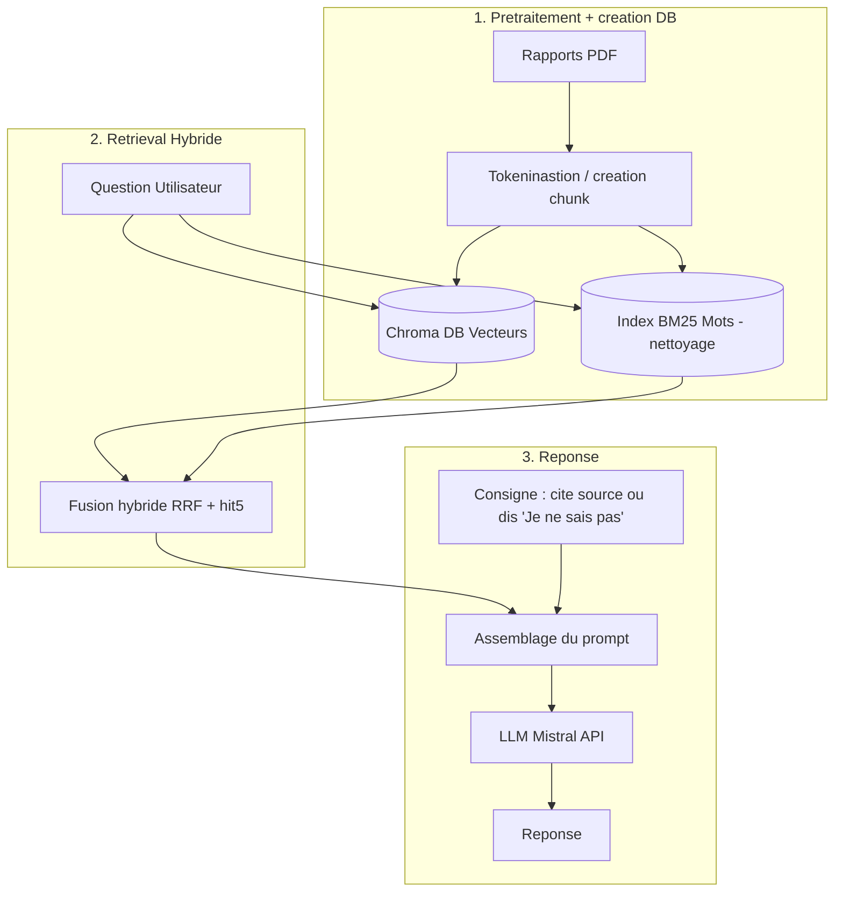

# Assistant de lecture de rapports financiers (RAG)

À partir des rapports financiers annuels de banques, l'assistant répond aux questions de l'utilisateur et justifie chaque réponse en citant la page du rapport utilisée.

Ce projet a pour but de pratiquer et de comprendre les briques d'un système RAG (*Retrieval-Augmented Generation*) : extraction de PDF, découpage en chunks, recherche vectorielle, recherche lexicale, fusion hybride, évaluation et génération par un LLM.

## Données

Les rapports utilisés sont publics et disponibles sur les sites des banques :
- [BNP Paribas](https://invest.bnpparibas/recherche/rapports/documents/rapports-financiers-et-sociaux) : Document d'enregistrement universel 2025 (français)
- [Crédit Agricole](https://www.credit-agricole.com/finance/publications-financieres) : comptes consolidés de Crédit Agricole S.A. 2025 (français)
- [UBS](https://www.ubs.com/global/en/investor-relations/financial-information/annual-reporting.html) : Annual Report 2025 (anglais)

Les PDF ne sont pas versionnés. Téléchargez-les et placez-les dans `data/raw/` sous les noms suivants (le préfixe est utilisé pour retrouver la banque dans `src/config.py`, donc si ajout de rapport de banques tel que `societegeneral_2024.pdf` pensez a ajouter les cles dans le dico `BANQUES` de `config.py`) :

```
data/raw/bnpparibas_2025.pdf
data/raw/ca_2025.pdf
data/raw/ubs_2025.pdf
```

## Installation

```bash
python -m venv .venv
source .venv/bin/activate
pip install -r requirements.txt
python -c "import nltk; nltk.download('stopwords')"
```

Le modèle d'embedding (`BAAI/bge-m3`, ~2 Go) est téléchargé automatiquement à la première utilisation. Sur CPU (AMD Ryzen 5000), l'indexation de tous les chunks prend environ 1 h 30 ; sur GPU (Google Colab T4 gratuit), une quinzaine de minutes.

## Structure

```
src/
  config.py       # chemins, banques, réglages (chunking, modèle, collection)
  extraction.py   # PDF -> pages nettoyées (data/interim/*.jsonl)
  chunks.py       # pages -> chunks avec identifiant (data/processed/chunks.jsonl)
  chroma.py       # index vectoriel (bge-m3 + Chroma, distance cosinus)
  bm25.py         # index lexical (tokenisation FR/EN + BM25) et retriever LangChain
notebooks/        # explorations et tests de chaque étape
data/             # non versionné : raw/, interim/, processed/, index/
NOTES.md          # limites connues et pistes d'amélioration
```

## Pipeline


<!-- ```mermaid -->
<!-- flowchart TD -->
<!--     subgraph Ingestion [1. Prétraitement et indexation] -->
<!--         A[Rapports PDF] -1-> B[Extraction et nettoyage<br>pymupdf4llm] -->
<!--         B -1-> C[Découpage en chunks] -->
<!--         C -1-> D[(Chroma<br>vecteurs bge-m3)] -->
<!--         C -1-> E[(Index BM25<br>mots)] -->
<!--     end -->

<!--     subgraph Recherche [2. Recherche hybride] -->
<!--         Q[Question] -1-> D -->
<!--         Q -1-> E -->
<!--         D -1-> F[Fusion RRF] -->
<!--         E -1-> F -->
<!--     end -->

<!--     subgraph Reponse [3. Réponse] -->
<!--         F -1-> P[Prompt + chunks] -->
<!--         S[Consigne : citer la source ou dire « je ne sais pas »] -1-> P -->
<!--         P -1-> LLM[LLM] -->
<!--         LLM -1-> R[Réponse + pages citées] -->
<!--     end -->
<!-- ``` -->

## Avancement

- [x] Extraction du texte avec `pymupdf4llm` (tri des blocs : images et pieds de page retirés) et nettoyage des balises
- [x] Découpage en chunks (`RecursiveCharacterTextSplitter`, 1 500 caractères), identifiant unique par chunk
- [x] Index vectoriel : embeddings multilingues `bge-m3` + Chroma
- [x] Index lexical : BM25 avec tokenisation français/anglais, retriever LangChain maison
- [ ] Fusion hybride (Reciprocal Rank Fusion)
- [ ] Jeu d'évaluation (~20 questions avec page attendue) et mesure du hit@5
- [ ] Génération de la réponse par un LLM, avec citation des sources
- [ ] Interface Streamlit

## Résultats

| Version | Changement | BM25 | Dense | Hybride |
|---|---|---|---|---|
| v0 | baseline | – | – | – |

Hit@5 sur le jeu d'évaluation. Les limites connues et les pistes d'amélioration sont listées dans [NOTES.md](NOTES.md).


