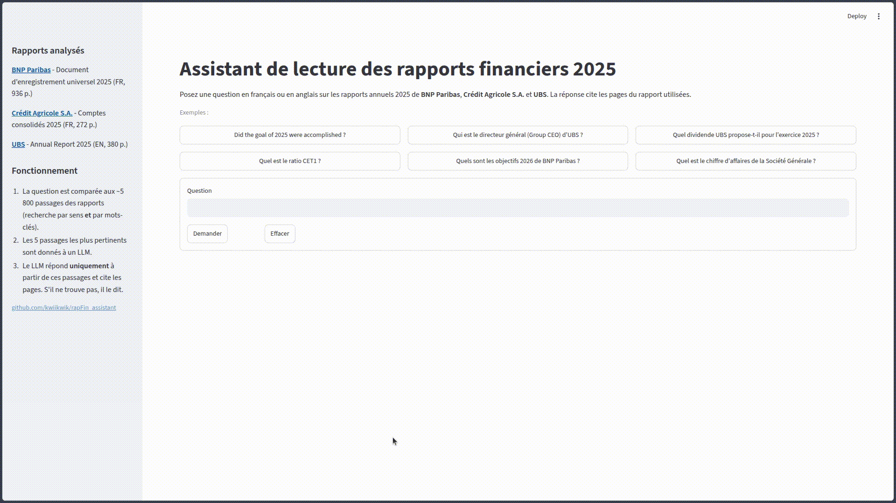
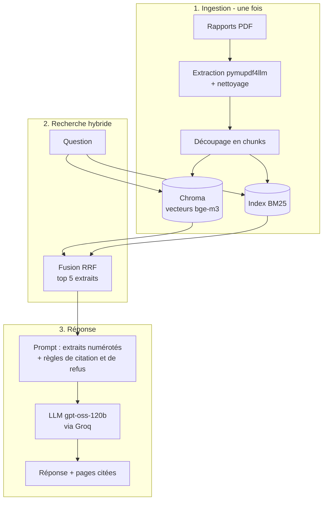

# Assistant de lecture de rapports financiers (RAG)

Posez une question sur les rapports annuels 2025 de **BNP Paribas**, **Crédit Agricole S.A.** et **UBS** : l'assistant répond à partir des documents et **cite les pages** utilisées. S'il ne trouve pas l'information, il le dit au lieu d'inventer.



**Démo en ligne : [rapport-financier-assistant-my.streamlit.app](https://rapport-financier-assistant-my.streamlit.app/)** (si l'app est en veille, cliquer sur le bouton pour la réveiller, ~1-2 min).
API de Groq gratuite donc peu de recherches par jours, merci de votre comprehension.

Ce projet a pour but de comprendre et de **mesurer** chaque brique d'un système RAG (*Retrieval-Augmented Generation*) : extraction de PDF, découpage en chunks, recherche vectorielle et lexicale, fusion hybride, génération par un LLM, évaluation.

## Résultats

Évaluation sur 24 questions écrites à la main (chiffres clés, questions reformulées, multilingues, tableaux, questions ambiguës).

| Version | Changement | hit@5 (retrieval) | Exactitude (réponse) | Citation correcte | Détail |
|---|---|---|---|---|---|
| v0 | baseline : bge-m3 + BM25, fusion RRF, gpt-oss-120b | 87,5 % | 70,8 % | 79,2 % | [docs/v0.md](docs/v0.md) |

- **hit@5** : la page qui contient la réponse est parmi les 5 extraits donnés au LLM.
- **Exactitude** : la valeur attendue figure dans la réponse finale.
- **Citation correcte** : au moins une page citée contient la réponse.

Principal enseignement de la v0 : les erreurs ne viennent pas d'hallucinations mais de **confusions de périmètre** (groupe / entité sociale, valeur réelle / cible) et de **tableaux mal découpés**. Analyse complète dans [docs/v0.md](docs/v0.md).

## Fonctionnement



| Brique | Outil |
|---|---|
| Extraction PDF | `pymupdf4llm` |
| Découpage | `RecursiveCharacterTextSplitter` (LangChain), 1 500 caractères |
| Recherche dense | `BAAI/bge-m3` (multilingue) + Chroma |
| Recherche lexicale | BM25 (`rank_bm25`), tokenisation FR/EN, classe LangChain maison|
| Fusion | Reciprocal Rank Fusion (`EnsembleRetriever`), poids 0,3 / 0,7 |
| LLM | `openai/gpt-oss-120b` via l'API Groq |
| Interface | Streamlit |

## Installation

```bash
git clone https://github.com/kwiikwik/rapFin_assistant.git
cd rapFin_assistant
python -m venv .venv
source .venv/bin/activate
pip install -r requirements.txt
```

Créer un fichier `.env` à la racine avec une clé API Groq (gratuite sur [console.groq.com](https://console.groq.com)) :

```
GROQ_API_KEY=...
```

### Données et index

> L'index (chunks et base Chroma) est fourni dans le repo : cette étape peut être sautée. Elle n'est utile que pour ajouter ou modifier des rapports, ou changer les réglages de découpage.

```bash
python -m src.ingest
```

Le script télécharge les rapports dans `data/raw/`, les extrait, les découpe en chunks et construit l'index Chroma. Certains sites bloquent les téléchargements automatiques (erreur 403) : dans ce cas, téléchargez les PDF à la main et placez-les dans `data/raw/` sous ces noms, puis relancez.

| Fichier | Rapport | Pages |
|---|---|---|
| `bnpparibas_2025.pdf` | [BNP Paribas](https://invest.bnpparibas/recherche/rapports/documents/rapports-financiers-et-sociaux) — Document d'enregistrement universel 2025 (FR) | 936 |
| `ca_2025.pdf` | [Crédit Agricole](https://www.credit-agricole.com/finance/publications-financieres) — Comptes consolidés de Crédit Agricole S.A. 2025 (FR) | 272 |
| `ubs_2025.pdf` | [UBS](https://www.ubs.com/global/en/investor-relations/financial-information/annual-reporting.html) — Annual Report 2025 (EN) | 380 |

Le nombre de pages permet de vérifier que vous avez la même version : le jeu d'évaluation référence des numéros de page.

L'indexation prend environ 1 h 30 sur CPU et une quinzaine de minutes sur GPU (Colab T4 : `from src.ingest import main; main(device="cuda")`). Si vous modifiez les réglages de découpage (`src/config.py`), supprimez `data/index/` pour reconstruire l'index.

### Lancer l'application

```bash
streamlit run app.py
```

### Ajouter un rapport

Nommez le fichier `banque_annee.pdf` (par exemple `societegenerale_2025.pdf`), ajoutez la banque dans le dictionnaire `BANQUES` de `src/config.py`, puis relancez l'ingestion après avoir supprimé `data/index/`.

## Structure

```
app.py              # interface Streamlit
src/
  config.py         # chemins, banques, liens des rapports, réglages
  ingest.py         # téléchargement -> extraction -> chunks -> index Chroma
  extraction.py     # PDF -> pages nettoyées (data/interim/)
  chunks.py         # pages -> chunks avec identifiant (data/processed/chunks.jsonl)
  chroma.py         # index vectoriel bge-m3 + Chroma
  bm25.py           # index lexical BM25 + retriever LangChain
  retrieval.py      # fusion hybride RRF
  generation.py     # prompt, appel au LLM, extraction des citations
  pipeline.py       # assemble retriever + LLM
  evaluation.py     # hit@5, MRR, éval de la génération
data/eval/          # jeu d'évaluation et résultats (seul dossier de data/ versionné)
docs/               # compte rendu détaillé de chaque version
notebooks/          # explorations de chaque étape
NOTES.md            # notes de travail : limites observées, idées
```

## Limites connues

- Les chiffres présents uniquement dans des **tableaux** sont mal retrouvés (en-têtes de colonnes séparés des valeurs).
- Confusions de **périmètre** entre chiffres proches (groupe / entité sociale, réel / cible).
- Évaluation sur 24 questions : 1 question = environ 4 points, les écarts faibles ne sont pas significatifs.
- API Groq gratuite : débit limité, environ une question toutes les 20 secondes.
